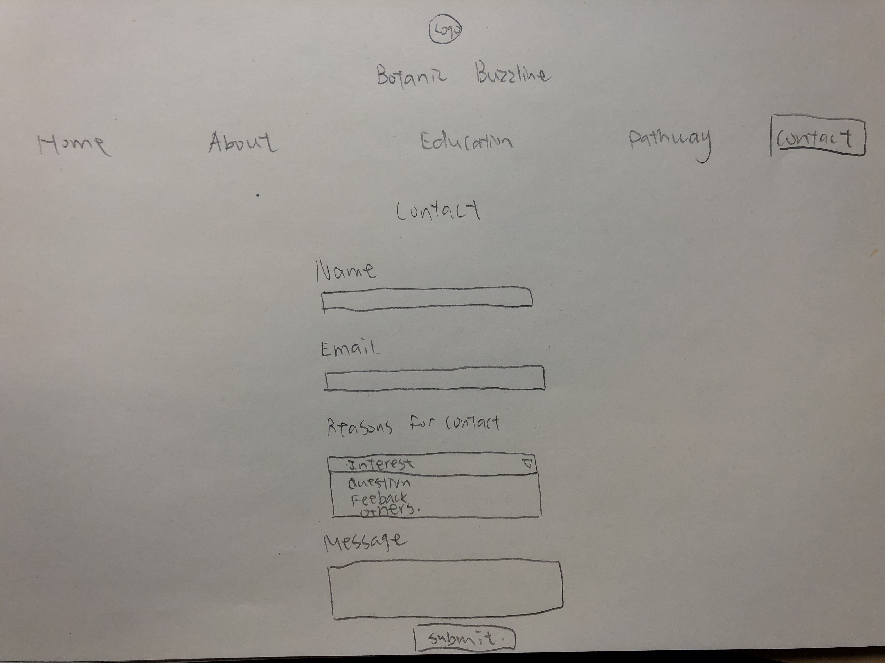

# Project 4 - Design & Plan

Your Team Name: golden-mammoth

## Milestone 1: Design your Client's Site

### Client Selection (Milestone 1)

The client we selected is Botanic Buzzline.

#### Client Description

[Tell us about your client. Who is your client? What kind of website do they want? What are their key goals?]

[NOTE: If you are redesigning an existing website, give us the current URL and some screenshots of the current site. Tell us how you plan to update the site in a significant way that meets the Project 4 requirements.]

Our client is a new team on campus called Botanic Buzzline. They are a small, eco-conscious team who focuses on environmental issues surrounding native pollinators, and raising awareness of these issues. Their team's main project is working on a project to create a pathway between Cornell students and pollinators in the Botanical Gardens area. Their mission statement is: "To connect people, plants, and pollinators on Cornell’s campus by planting a 980 square foot flowing pathway from Tower Road into the botanic gardens."

It's important to note that Botanic Buzzline is NOT a club. It is a team of students working of a project together, which is the pathway and to educate people on native pollinators. Thus, they do not have weekly or monthly meetings like a club would. They just meet with each other when they are all available to plan out Planting Day.

This team does not have formal recruitment. They said that anyone who is interested in working on the project can just send them an email. Also, their current hierarchy of Eboard and members may change in the future once the pathway has been completed. I was told by a member that how Botanic Buzzline will end up evolving is all "up in the air." Once the pathway is finished they will still have the goal of educating people on local pollinators, but it may change from a team to a club of gardening enthusiasts who will help to maintain the pathway.

I was informed that the site we should make for them should be based off of what they currently are now, which is a team. A team focused on building the pathway and educating people on local pollinators.

They told us that their main goals of a website is for them to improve local biodiversity, educate public about importance of native pollinators, and communicate effectively with followers/donors about updates. Since the team is so new, they are also trying to raise awareness of themselves as a team, in hopes to get more members involved or get volunteers.

Their key goals is to have people understand their vision for the Pathway and why the Pathway matters. Furthermore, their goal is to be able to show what results they are creating by having the Pathway featured in some way. They hope to educate people on natural pollinators in order for people to understand why protecting natural pollinators matters.
### Client Needs & Wants/Requirements (Milestone 1)

Client wants a home page, about page, a page dedicated to education, an updates page that may end up as part of the home page as a sidebar, a page dedicated to their big pathway project, and contact page.

They want a colorful, site that uses "flowery" colors like greens and yellows, but they don't want flowers everywhere.

They need a website that is responsive that people can view on their mobile phones, and a form that uses feedback.

They need people to see what the Pathway currently looks like. This is critical for them because they want to show that they can get results done, rather than be a team that says things, but doesn't actually do anything.

#### Purpose & Content

[Tell us the purpose of the website and what it is all about.]
This website would serve as a hub for this club to put information that they deem important. It will hold pictures of members and projects, as well as educational information and a form that will be used to contact the club. They have already given us a lot of pictures and videos that we can use on the website, all of which can be found in the content folder.
Through the website they will be able to inform their target audience about the importance of native pollinators and update them about the status of their project. From this they can get people involved in the project by letting people know when their planting day is.

#### Client Needs and Wants

[Collect your client's needs and wants for the website. Come up with several appropriate design ideas on how those needs may be met. In the **Memo** field, justify your ideas and add any additional comments you have. There is no specific number of needs required for this, but you need enough to do the job.]

- Needs/Wants #1
  - **Needs and Wants** [What does your client and audience need and want?]
    - Client wants to educate masses.
  - **Design Ideas and Choices** [How will you meet those needs and wants?]
    - We will have a separate page for education that will allow the organization to put up educational information.
  - **Memo** [Justify your decisions; additional notes.]
    - This information can be edited and updated based on what they want to educate about.
- Needs/Wants #2
  - **Needs and Wants** [What does your client and audience need and want?]
    - Client wants to provide easier access to contacting the organization and have a place for donors from the crowdfunding campaign to ask questions and learn more about the organization.
  - **Design Ideas and Choices** [How will you meet those needs and wants?]
    - We will have a form for contacting the website.
  - **Memo** [Justify your decisions; additional notes.]
    - It will have feedback, and allow anyone interested to sign up for a listserv as well as send a message of some kind.
- Needs/Wants #3
  - **Needs and Wants** [What does your client and audience need and want?]
    - Client wants to showcase their large-scale project, and recruit people to help on next steps.
  - **Design Ideas and Choices** [How will you meet those needs and wants?]
    - We will have a page dedicated to the pathway they are building.
  - **Memo** [Justify your decisions; additional notes.]
    - Page will have pics and videos of project, as well as details on how to get involved.
    - Page will tell those interested in volunteering to sign up for the team's listserv, so they can be updated on when events will take place.

#### Client Meeting Notes

[By this point, you have met once with your client to discuss all their requirements. Include your notes from the meeting, an email they sent you, or whatever you used to keep track of what was discussed at the meeting. Include these artifacts here.]

Meeting took place Tuesday, November 13, 2018.

### Target Audience (Milestone 1)

#### Target Audience(s)

Our target audience is people who like nature and are interested in plants and pollinators. These audience members also should be interested in learning about pollinators and have an interest in learning more.

#### Target Audience Needs

[What are the needs of your target audience(s)? Note that these are probably *not* the needs of your client.]

Target audience needs to be more knowledgable about native pollinators and the importance of biodiversity. They also need to be aware and supportive of the goal to create this pathway, and to be willing to collaborate with the Botanic Gardens. Finally, they need to know the schedule of planting days, which is to come in the spring.                    

### Initial Design (Milestone 1)

#### Content

[Place your content in the **content** folder. NOT in the documents folder.]

[Note any content (e.g., text, image) that you need to make/get from the client here.]

We are just waiting to get information for the education section portion of the website, which is just text.

#### Content Organization, Information Architecture, and Navigation

[Lay out the plan for how you'll organize the site and which content will go where. Plan out the navigation for the site. Document your process for organizing the content.]

[Note: As with the Needs and Wants table, there is no specific amount to write here. You simply need enough content to do the job.]

- **Navigation**
  - Home
  - About
  - Education
  - Pathway
  - Contact

- **Content** (List all the content corresponding to main navigation and sub-categories.)
  - *Home*: A slideshow the client asked for, a brief introduction of the club, images, and a updates side bar.
  - *About*: Mission statements, and goal of the team, and a photo of members of the club together.
  - *Education*: Photo and the importance of native pollinators.
  - *Pathway*: a slideshow with several photos and captions.
  - *Contact*: a form that allows students to contact the club and join listerv.

- **Process**
  - Based on our meeting with the client, our current navigation design addresses all the aspects of the website that they believe are the most important. Botanic Buzzline wanted content covering each topic in our navigation, and we thought this was the best way to divide it so it makes the most sense.

#### Sketches

Desktop Sketches:

Mobile Sketches

These are the sketches that will be seen on the website:

New Desktop Sketches:

New Mobile Sketches:

Footer Sketches:
Here is the sketch of what the footer looked like in desktop and mobile for when we demoed our site in lab 13.

Here are the new sketches of what the footer looks like and what you will see on our actual site.

#### Interactivity

We will have interactivity on our contact page in the form of feedback on our contact form, and we want to put a slideshow on the pathway page. The design of our feedback can be found in a sketch above. We are unsure of the exact design/functionality of the slideshow, but it is also shown in a sketch.
A slideshow is good for our target audience because for people who are interested in native pollinators they can see what Cornell students are doing to ensure their survival. Originally we thought of creating a collage of images of the pathway. However, we realized that for a better user experience we can make it that the user decides how much he wants to see.

#### Additional Comments (Milestone 1)

[If you feel like you haven't fully explained your design choices, or if you want to explain some other functions in your site (such as special design decisions that might not meet the Project 4 requirements), you can use this space to justify your design choices or ask other questions about the project and process.]

## Milestone 2: Draft of Coded Website

### Interactivity (Milestone 2)

[Write your interactivity pseudocode here. Remember you must use two conditional statements.]

Contact Form Feedback:
  When the user tries to submit the form:

  If name is empty:
    Show an error message for the "Name" input that says "Enter in a name."
    Background color becomes yellow.
  Otherwise;
    Show no error message for the "Name" input.
    No Change in Background color.

  If email is invalid:
    Show an error message for the "Email" input that says "Enter in a valid email."
    Change background to be yellow.
  Otherwise:
    Show no error message and don't change the background color of the email section to be yellow.

  If email is empty:
    Show an error message for the "Email" input that says "Enter in an email."
    Change the background color to be yellow.
  Otherwise:
    Show no error message and don't change the background color of the email section to be yellow.

  If any input is invalid:
    The submit button will have a message below it that says "Please Check the Inputted Information Above!"
  Otherwise:
    Submit form

Home Slideshow Pseudocode:
  When the user clicks the next arrow:
    Increment the current image index.
    If that number exceeds 9:
      Make 0.
    Change the viewed image on the page to the current index we just calculated.
    Change the viewed caption on the page to the current index we just calculated.
  When the user clicks the previous arrow:
    Decrement the current image index.
    If that number goes to -1:
      Make 8.
    Change the viewed image on the page to the current index we just calculated.
    Change the viewed caption on the page to the current index we just calculated.

Pathway Slideshow Pseudocode:
  When the user clicks the next arrow:
    Increment the current image index.
    If that number exceeds 5:
      Make 0.
    Change the viewed image on the page to the current index we just calculated.
    Change the viewed caption on the page to the current index we just calculated.
  When the user clicks the previous arrow:
    Decrement the current image index.
    If that number goes to -1:
      Make 4.
    Change the viewed image on the page to the current index we just calculated.
    Change the viewed caption on the page to the current index we just calculated.

Education Insect Pseudocode:
  If insect text is hidden:
    When the user clicks the link:
      Remove the hidden class for the insect text
      Show the insect text
  If insect text is showing:
    When the user clicks the link:
      Add the hidden class for the insect texts
      Hide the insect text

### Tasks (Milestone 2)

[You will need to come up with at least 4 tasks. List your tasks here. You *do not* have to do user tests yet.]

Task 1: [describe your task]
You want to know how you can add your email to the listserv and in doing so, learn about the pathway, as well as native pollinators.

Task 2: You want to learn about the mission statement and goals of Botanic Buzzline.

Task 3: You want to get to know what the pathway looks like and what planting plants on it will be like.

Task 4: You want to know when Planting Day will be.

### Client Meeting (Milestone 2)

[By this point, you have met once with your client a second time to discuss your initial design. Include your notes from the meeting, an email they sent you, or whatever you used to keep track of what was discussed at the meeting. Write a few sentences about the design feedback you received from your client.]

This phone call was about how the education page section will not prepared until 3 weeks and to just put in lorem ipsem (filler text).

Notes from Meeting 2 on Sunday, Nov 18

We received very valid and helpful feedback from our client that I really appreciated getting. When it comes to our iPad version, they want it to look more similar to the desktop version rather than the mobile version. Though we were not fully done with styling it, I agree that for when we are done it should look more similar to the desktop version instead of the mobile version. This makes sense because going from desktop to tablet shouldn't be such a striking difference since a tablet size is closer to the size of a desktop computer.

Client really wants improvements on Education page, such as decreasing the size of the picture and choosing a better looking photo. In order to make the page look more appealing they would like photos of the bugs that are described to be included on the page. From this we must find photos online that we have permission to use, in order to avoid copyright infringement. Client also said they might have photos of the bugs and that they might be in the photo library they sent us, thus we need to look through it.

Client originally had wanted lorem ipsem on the education page, but we were given permission at this meeting to use the content they had written on their crowdfunding site. Thus, we will be able to remove the citations that appear on screen.
Client had noticed tiny flaws that we didn't catch. This includes that in the pathway page we forgot to remove the link on the "Botanic Buzzline" <h1> at the top of the page. Also, client noticed that one of the feedback messages specifically the submit feedback message was still showing.
Having a pair of fresh eyes look at our work is helpful because it helps us to see small flaws we made and it shows us how we can improve our design.

### Additional Comments (Milestone 2)

[If you feel like you haven't fully explained your design choices, or if you want to explain some other functions in your site (such as special design decisions that might not meet the Project 4 requirements), you can use this space to justify your design choices or ask other questions about the project and process.]

### As we designed our website we were trying to decide what color scheme to use based off of the colors our client wanted
We originally thought of doing this dark green background. However, with the way it was set up this site just didn't look clean and there was too much green. Thus, we changed the coloring of our website to what we made it in the submission of milestone 2.

Here is what the site originally looked like with the dark green background.

## Milestone 3: Presentation & Demo Ready Draft

### Additional Comments (Milestone 3)

[If you feel like you haven't fully explained your design choices, or if you want to explain some other functions in your site (such as special design decisions that might not meet the Project 4 requirements), you can use this space to justify your design choices or ask other questions about the project and process.]

link to the heroku website we created for our client.
Our client wanted to see what the site looked like live on Heroku, in order to see the form work on their site. Our client is still deciding whether or not they will actually use Heroku.
https://shielded-stream-32218.herokuapp.com/index.html

Our client had emailed us asking us to create some edits to the website.

This is what our "about.html" page had looked like with the Instagram feed on it. However, the problem with is was that one it wasn't responsive for mobile phones. The images would be too small and there was no way to adjust the way the widget had set it up. When you clicked the image it would show you only that image with whatever caption was written. The problem was that the widget didn't have that event for seeing the image with the caption be responsive. It would remain the same size as it was on desktop version.

We met with the client on Wednesday to discuss having an Instagram feed on the website. A problem we came across was that some widgets were not fully responsive or when you clicked on the image it wouldn't lead directly to the Instagram website. Rather, it would lead to the widget's website. Our client didn't want to use widgets with free trials because they didn't want to commit to a third party site and have to pay for future use.

Sketch for Index Page for Milestone 3 to show what the footer originally looked like when the footer was included. The footer ended up changing after this and we showed the sketch for how we changed the footer. You can find the sketch for the footer we ended up using in the demo and the new footer that is being used. These sketches can be found earlier in the design journey in the Milestone 1 area where the sketches for pages exist.

## Final Submission: Complete, Polished, and User Tested Website

### Changes Based on Presentation (Final Submission)

Some changes we made based off of our peer feedback was that we needed to have a more consistent font throughout the pages. Also, we realized that when we create our designs we should look at both of Firefox and Chrome. This is because on Firefox and Chrome our website looked a little different. For example, fonts would look different because standard default fonts in CSS look different on Firefox and Chrome. So, we decided to import fonts locally into our project in order for the fonts to look the same on both browsers. We also wrote different fonts in our CSS in the order of hierarchy based off of what we wanted the font to be. The reason we did this was in the case that the font that we wanted to show didn't show we had a backup of what that font would be. Also, we originally had on the homepage the word "Update:" underlined. However, our peers brought up the fact that even though we were trying to emphasize the word "Update:" it didn't make sense to underline it because we never underlined any other word on our page. Thus, it made the page look inconsistent. Other feedback we got was that we needed to improve spacing on our pages. For example, the title of the Education Page was too close to the picture originally to the point that they were actually touching. We were also told that we should change the coloring of our nav bar to a different type of green since the one we were using was a duller looking green that didn't look inviting or exciting to look at. Hence, we have since changed it to a deeper and richer green. This was a better choice because it represents well how our client is an environmental conservation group and how a deeper green is associated more with fertility and life. We are going to make the Education Page more interactive by giving users the choice of whether or not they want to learn additional information about insects. We are going to have users have the capability of clicking on a statement along the lines of like for example "Click to Learn More About Beetles" and the then the user clicking. The user will then will get a paragraph about beetles. This was done because we noticed that a lot of people during our demo mentioned there was a lot of text.

### Client Meeting 4 ###

 During this meeting was discussions of final edits they would like seen. Our client liked the new color scheme and fonts we had chosen because they thought it made the page look more lively. We explained to them our idea for interactivity on the education page due to comments we had gotten for there being too much text. We told them we don't have to remove it. But, we need to change the way it's presented in which users feel like they have an option and are included in the process of learning more about insects. They shouldn't feel like a bunch of information is being thrown at them. We told them by changing the layout and adding interactivity to it users will feel more in charge of his/her experience. Thus, users will be more inclined to read and learn more. We told them that by reducing the amount of text that appears initially users will feel more comfortable with the amount of text there.

### User Testing (Final Submission)

#### Participant 1

1. Who is your participant, e.g., what is their name, where do they comes from, what is their job, characteristics, etc.?
My participant is Laura. She is a Junior at Cornell University majoring in plant science. Plants are Laura's passion. Her interest about plants comes from her family because her parents cultivate many plants in their house. She has always had a strong appreciation of nature since she was a little girl. She loves exploring the diversity of plants. At school, she is always watching out for opportunities to learn about plants volunteer works, related researches and other activities.

2. Does your participant belong to your target audience of the site? (*Yes* / No)
Yes
[If “No”, what’s your strategy of associating the user test results to your target audience’s needs and wants? How can your re-design choices based on the user tests make a better fit for the target audience?]
Yes.

[Report the results for your user's performance on each of your tasks. You should **describe the task** you ask the user to complete, explain **what the user did**, describe the user's **reaction/feedback** to the design, **reflect on the user's performance**, determine what **re-design choices** you will make. You can also add any additional comments in the **memo** field.]

Format:
- Task #1
  - **Task Description** (What was the task for this user?)
    - You want to know how you can add your email to the listserv and in doing so, learn about the pathway, as well as native pollinators.
  - **How did the user do? Did that meet your expectation?**
    - The user clicked on Pathway button
    - looked through the texts on pathway Page
    - found the information to sign up on contact Page
    - went to contact page to fill out the form and submit
    - User's behavior met my expectation because she finshed the task successfully
  - **User’s reaction / feedback to the design** (e.g., specific problems or issues found in the tasks)
    - User went to pathway first and it took her some times to look over texts and found the information she wanted.
  - **Your reflections about the user’s performance to the task**
    - User can finish this task smoothly but it could be in a more effective way.
  - **Re-design choices**
    - Highlight the information(in different color or use text decoration)

- Task #2
  - **Task Description** (What was the task for this user?)
    - You want to learn about the mission statement and goals of Botanic Buzzline.
  - **How did the user do? Did that meet your expectation?**
    - The user went to homepage and looked over all contents carefully and did not find the answer.
    - Then she clicked on about button
    - found the information she wanted
    - User's behavior met my expectation because she finshed the task successfully
  - **User’s reaction / feedback to the design** (e.g., specific problems or issues found in the tasks)
    - It took her some times to stop at homepage to find information.
  - **Your reflections about the user’s performance to the task**
    - Her first instinct is that these information should be on homepage.
    - On about page, the different font style and background color make the information easier to find and seperated well.
  - **Re-design choices**
    - Keep current design

- Task #3
  - **Task Description** (What was the task for this user?)
    - You want to get to know what the pathway looks like and what planting plants on it will be like.
  - **How did the user do? Did that meet your expectation?**
    - The user went to the pathway page
    - looked at the photo of the pathway
    - The user's behavior somewhat met my expectation.
  - **User’s reaction / feedback to the design** (e.g., specific problems or issues found in the tasks)
    - Although the user knew where she need to go to find the information very quickly as she got the task, she did not notice that there are left and right arrows to see more photos.
  - **Your reflections about the user’s performance to the task**
    - The colorful photo makes arrows be a little invisible on it
  - **Re-design choices**
    - make a translucent background color square under the arrow

- Task #4
  - **Task Description** (What was the task for this user?)
    - You want to know when Planting Day will be
  - **How did the user do? Did that meet your expectation?**
    - The user went to homepage and looked at the first paragraph (Welcome...)
    - scrolled up to the nav bar and clicked about button
    - went back to homepage and found the information on sidebar named Updates
  - **User’s reaction / feedback to the design** (e.g., specific problems or issues found in the tasks)
    - At first she did not find the information on homepage but she got back as she did not find it either on about page
  - **Your reflections about the user’s performance to the task**
    - Updates sidebar in not obvious for user
  - **Re-design choices**
    - Make the Updates sidebar wider

[Include evidence of your user testing process.]

#### Participant 2

1. Who is your participant, e.g., what is their name, where do they comes from, what is their job, characteristics, etc.?

My participant is Shreya, who is an international student from India. She is a computer science major who is interested in using her programming skills to help plant biology to maximize plant growth in agriculture. She is in a variety of extracurriculars at Cornell, including being a python consultant and being on a dance team. She spends her free time traveling in Ithaca and admiring the nature as she did so often when she was younger.

2. Does your participant belong to your target audience of the site? (*Yes* / No)
Yes

[If “No”, what’s your strategy of associating the user test results to your target audience’s needs and wants? How can your re-design choices based on the user tests make a better fit for the target audience?]

[Fill this out like you did for Participant 1 above]

- Task #1
  - **Task Description** (What was the task for this user?)
    - You want to know how you can add your email to the listserv and in doing so, learn about the pathway, as well as native pollinators.
    - **How did the user do? Did that meet your expectation?**
    The user scrolled through the home page, possibly to see how the website is structured, and then the pathway and about pages, before going to the contact page, so she found all the correct information. Then, she inputted her information in and added herself to the listserv successfully.
    - **User’s reaction / feedback to the design** (e.g., specific problems or issues found in the tasks)
    She likes the green theme a lot, but thinks that if one were to join a listserv, they shouldn't have to select a reason for contact.
    - **Your reflections about the user’s performance to the task**
    User finished the task pretty smoothly and did everything correctly.
    - **Re-design choices**
    Possibly delete the reason for contact.

- Task #2
  - **Task Description** (What was the task for this user?)
    - You want to learn about the mission statement and goals of Botanic Buzzline.
  - **How did the user do? Did that meet your expectation?**
    The user immediately went to the about page and found the mission statement and goal. This made sense because I felt this was the right direction to take.
  - **User’s reaction / feedback to the design** (e.g., specific problems or issues found in the tasks)
    It was very easy to find the goal and the mission statement. Everything was in one place so she didn't have to search much. Very good.
  - **Your reflections about the user’s performance to the task**
    The user performed well and did all the right things, the information on our website is pretty straightforward.
  - **Re-design choices**
    Keep current design.

- Task #3
  - **Task Description** (What was the task for this user?)
    You want to get to know what the pathway looks like and what planting plants on it will be like.
  - **How did the user do? Did that meet your expectation?**
    The user did well, immediately navigating to the Pathways page and clicking through the images. However, she didn't realize at first that this was a slideshow because buttons were not immediately visible.
  - **User’s reaction / feedback to the design** (e.g., specific problems or issues found in the tasks)
    She likes the gallery a lot and thinks it was a good interactive element.
  - **Your reflections about the user’s performance to the task**
    She did well, but it took her a little bit of time to find the arrows. Perhaps make them more colored.
  - **Re-design choices**
    Can write click to go onto next picture on top of the slideshow.

- Task #4
  - **Task Description** (What was the task for this user?)
    - You want to know when Planting Day will be
  - **How did the user do? Did that meet your expectation?**
    The user went to the Pathways page and scrolled down, thinking the information was in one of the paragraphs. But it was not specific enough information so eventually after some prodding she went to the home page and found the planting day information.
  - **User’s reaction / feedback to the design** (e.g., specific problems or issues found in the tasks)
    Pretty easy to find, likes sidebar because it looks pretty.
  - **Your reflections about the user’s performance to the task**
    She thought the updates were easy to find.
  - **Re-design choices**
    Make update bars wider and pop out more, possibly with a glow effect.

[Include evidence of your user testing process.]

#### Participant 3

1. Who is your participant, e.g., what is their name, where do they comes from, what is their job, characteristics, etc.?

Anthony is a sophomore AEM major who grew up in China but moved to NYC when he was 13. Living in a large city in China, he never really got to interact with plants as much as he liked and he was devastated at the pollution that came from the city. He heard that the US was more nature-friendly, but upon coming to NYC he was disappointed. Now that he's in Ithaca, he finally feels at home and that he can be close to the plants he's always liked. In school, he enjoys going to the gym and hopes to rush a business fraternity soon.

2. Does your participant belong to your target audience of the site? (*Yes* / No)

[If “No”, what’s your strategy of associating the user test results to your target audience’s needs and wants? How can your re-design choices based on the user tests make a better fit for the target audience?]

[Fill this out like you did for Participant 1 above]

- Task #1
  - **Task Description** (What was the task for this user?)
    - You want to know how you can add your email to the listserv and in doing so, learn about the pathway, as well as native pollinators.
    - **How did the user do? Did that meet your expectation?**
    The user took some time to adjust to the website, but first navigated to the contact page where he inputted his information. He then found the Pathways page pretty easily, and it took him some time to find the Education page. This made sense because "contact" and "pathways" were words that were in the tabs at the top but the word "native pollinators" was not.
    - **User’s reaction / feedback to the design** (e.g., specific problems or issues found in the tasks)
    The user thought the education page was confusing and didn't realize he could learn about native pollinators there. Otherwise, he thought the contact page was okay and the pathway was straightforward.
    - **Your reflections about the user’s performance to the task**
    I think the user completed the two latter parts of the task pretty well but it might be good to make the word Education more clearer to show what kind of content may be on the page.
    - **Re-design choices**
    Possibly write in "Insect Education" to let users know what is on the Education page.

- Task #2
  - **Task Description** (What was the task for this user?)
    - You want to learn about the mission statement and goals of Botanic Buzzline.
  - **How did the user do? Did that meet your expectation?**
    The user at first scrolled through the Education page and thought the mission statement was there, but after some prodding he went to the About page and found a more clear mission statement and goal. I thought it was clear that the mission statement and goals should not be on the Education page.
  - **User’s reaction / feedback to the design** (e.g., specific problems or issues found in the tasks)
    The user thought the information was easy to find and presented clearly.
  - **Your reflections about the user’s performance to the task**
    The user thought this section was done well.
  - **Re-design choices**
    Keep current design.

- Task #3
  - **Task Description** (What was the task for this user?)
    You want to get to know what the pathway looks like and what planting plants on it will be like.
  - **How did the user do? Did that meet your expectation?**
    The user easily found the Pathways page but did not notice the buttons for the slideshow. This made sense as the buttons were not very visible.
  - **User’s reaction / feedback to the design** (e.g., specific problems or issues found in the tasks)
    Thought the gallery was cool and pathways page easily but didn't see buttons. He thinks the buttons should be moved outside of the pictures so users can find them easily to avoid confusion
  - **Your reflections about the user’s performance to the task**
    The user did as expected, and we can see that the buttons' visibility are a problem for many people.
  - **Re-design choices**
    Move buttons outside of picture.

- Task #4
  - **Task Description** (What was the task for this user?)
    - You want to know when Planting Day will be
  - **How did the user do? Did that meet your expectation?**
    The user went to the about page and didn't find anything, so then he went to the home page and scrolled past the updates but did not notice that is where the information is. I was a bit surprised he did not see the Updates box.
  - **User’s reaction / feedback to the design** (e.g., specific problems or issues found in the tasks)
    He thought the Updates box was hard to see, so he thinks that should be put horizontally and not on the side and rather parallel to the structure so that the Updates could be easier to see.
  - **Your reflections about the user’s performance to the task**
    I was a bit surprised the user did not see the Updates box but I agree that it should pop out more and not be so squished vertically.
  - **Re-design choices**
    Make update bars wider and pop out more, possibly with a glow effect.

[Include evidence of your user testing process.]

### Changes Based on User Testing (Final Submission)

[What changes did you make to your plan or design based on user testing?]

For the contact form a user didn't understand why she would have to put a reason for contact if she had to sign up for the listserv. However, putting a reason was not a required field. The only mandatory fields are name and email. We are keeping the reason for contact part because that is very standard on forms. the purpose of the "Reason For Contact" was so that when the client views the form data they can see what the message is categorized under. We can make that clearer by making it more clear what we want by changing the wording. We can change the wording from "Reason For Contact" to "Reason for Message." This makes it more clear that you only had to indicate a reason only if you are writing a message not if you are signing up for a listserv.

Due to user suggestion, the Updates section was made larger in width on Home page to make it more visible.

Due to user suggestion, we made the buttons of all slideshows more visible at all times.

### Final Notes to the Clients (Final Submission)

[Describe in some detail what the client will do (or would have to do) in order to make this website go live. What is the deployment plan?]

The website is actually already up on Heroku live since our client wanted to see how the website's contact form actually worked. Hence, if they do end up deciding to use Heroku all they would need to do is change the website's domain name to their team's name. Our client is still in the process of deciding who they want to officially host their website and they said they will decide that during the break between Fall and Winter semester. If they choose not to use Heroku it has already been discussed that they can send me an email and I will take it down from Heroku. For the time being they are fine with it being up on Heroku.
Our client and us have come to the decision that we will put the files for their project into Cornell Box, which is a system similar to Google Drive in which you can share files with others. Once we upload the files onto Cornell Box we will share it with our clients so they will be able to easily download it.
Also, to note we are only going to give them the www folder. This is because the content folder and documents folder are not pertinent for them to have. Their concern is getting the actual product not looking at our write ups.
We also are going to give them the Client Hosting Notes that Professor Harms wrote so they can figure out how to make their website live on their own.

[Include any other information that your client needs to know about your final website design. For example, what client wants or needs were unable to be realized in your final product? Why were you unable to meet those wants/needs?]

Our client wanted to have Instagram embedded on their webpage. We didn't want to just embed singular posts because it didn't make sense to have the same post always up on the site that would eventually become an old post. Thus, we had decided that we would put in an Instagram feed gallery on their website. I had done a lot of research as to what was the best platform to use and which would be responsive to different screen sizes. We also knew that they were on a budget. Even though they just had a crowdfunding event they really wanted to keep all of that money strictly for purposes of finishing the pathway, which I understand. Hence, we were restricted to looking at free widgets that could embed an Instagram feed. I had found Pixlee and even though it says it is responsive, it actually isn't. For starters the images are too small in mobile mode and when you click on the image the image you get of the post with the comments does not actually fit the space of the phone properly. Hence, we could not use Pixlee for our final submissions. Even after looking at other free alternatives they had cons to them, such as not actually taking the user directly to the Instagram page which would have been weird for a user to see.

### Final Notes to the Graders (Final Submission)

[1. Give us three specific strengths of your site that sets it apart from the previous website of the client (if applicable) and/or from other websites. Think of this as your chance to argue for the things you did really well.]

1. A strength of our website is its simplicity. Since this was a gardening site we didn't want to have lots of things going on that would distract from the pathway and the photos of nature.

2. Our site is easy to navigate. All of our content is under sections in the navigation bar that make sense of where you would find new content. Also, we have provided several ways to navigate. A user can navigate through the nav bar, the clickable images on the home page, and through the footer.

3. On the education page under the "Learn About Insects" section of the page we include our users by allowing users to have the option of whether or not they want to learn more. By including the users we are making the user feel more engaged in the process. This is valuable because if we just had all the text there users would feel like information is being forced on them. The strength of this design is that we allow users to feel like they are in charge of their experience in learning what sparks their interest most. Also, the users being able to click which insect makes the users feel more intrigued by it because they will wonder what more they can learn and are more likely to look at it rather than if it was given to them.

[2. Tell us about things that don't work, what you wanted to implement, or what you would do if you keep working with the client in the future. Give justifications.]

We would really like to implement in the future the Instagram feed. Perhaps in the future Instagram will release an official way to do this through their site. Since, the only way to do this is through third party companies. This isn't under the justification that it would look "cool." It is because if we could find one that naturally updates itself when a user goes to their website they can see what the Pathway most currently looks like and see what the team is working on.
We would have liked to implement an Eboard page. However, during one of the meetings I was informed that they might be changing positions soon, so it didn't make sense for me to contact members if they might not even be in the position they are currently in next semester. Also, this has to do with Botanic Buzzline is uncertain what they will become after the Pathway is finished. They may end up changing from being a team to becoming a club of gardening enthusiasts. That is speculation some Eboard members have, but that is not yet a final decision.

[3. Tell us anything else you need us to know for when we're looking at the project.]

Of course this project was being able to learn to work with a client. One thing though to note was that our client flip flopped a lot, which hindered our project progress. For example, with the images of insects on the education page. We initially were going to put in images of the different insects, so that the page would look more interesting. Also, our client had told us he wanted images of insects there. But, then later told us he didn't want them anymore. This is why the education page doesn't have a lot of images because our client didn't want us to include images from the internet because he was worried about copyright issues.
